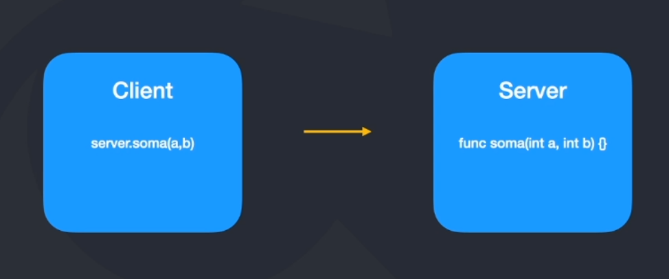
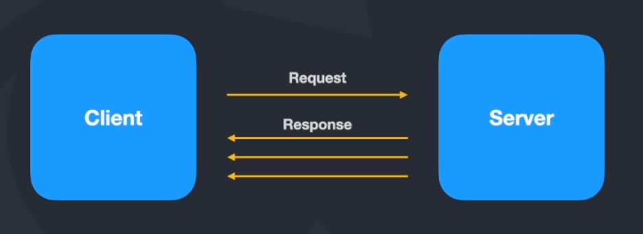
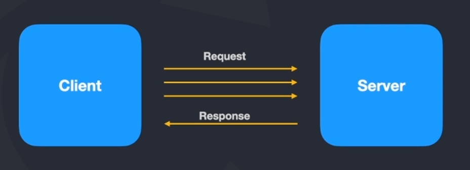
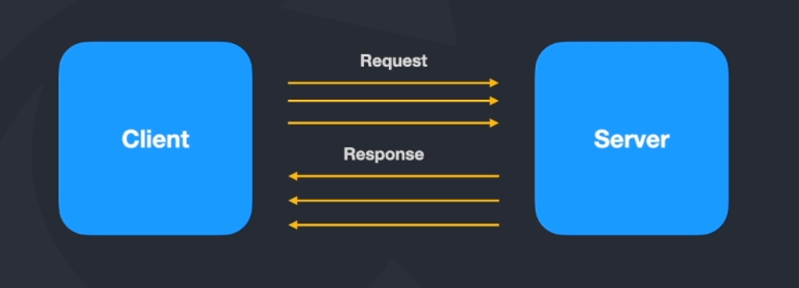

# gRPC

-   É um framework desenvolvido pelo Google que facilita o processo de comunicação entre sistemas, de forma rápida, leve e indepedente de linguagem.
-   Mantida pela CNCF que é a mesma que mantém o Kubernetes e OpenTelemetry;
-   É uma forma segura de trabalhar comunicações entre sistemas;
-   Totalmente dependente do protocol buffers;
-   Como ele é uma plataforma nova que consegue rodar principalmente com web no protocolo http/2.

## Links importantes

-   [grpc.io](https://grpc.io/)
-   [protobuf.dev](https://protobuf.dev/)

## Onde é ideal para utilizar?

-   Microserviços;
-   Mobile, browser e backend;
-   Geração de bibliotecas de forma automática.

## Linguagens com suporte oficial

-   Java
-   GoLang
-   C

Através do gRPC-C é possível utilizar python, nodejs, kotlin e etc.

## O que significa na prática o Remote Procedure Call?



O cliente realiza uma chamada no servidor, que evoca uma função para que o server consiga responder a essa requisição.

No passado, se utilizava muito XML para fazer essas requisições, por conta dos contratos pré definidos e etc.

## Protocol Buffers

-   É uma linguagem criada de forma neutra com mecanismo de extensibilidade e serialização de dados, é como se fosse um XML, com contratos pré definidos só que menor, muito mais rápido e mais simples.
-   Os dados trafegados são em formato binários;
-   Trabalha em cima de contratos;
-   Necessita realizar a serialização e descereliação dos dados;
-   Pode ser utilizado indepedente do gRPC.

## Diferença entre protocol buffers vs Json

-   PB trabalha com arquivos binários, de modo que são extremamente menores em comparação a um arquivo Json.
-   PB quando serializa os dados, o processo é muito mais rápido que arquivos JSON, o consumo de CPU é menor.
-   PB gasta menos recursos de rede porque o arquivo é menor;
-   PB o processo de comunicação é mais rápido.

### O contrato do protocol buffers


Tal padrão é conhecido como protofile.

Normalmente se utiliza a versão 3 para o gRPC.

## https/2

-   Nasceu com nome de SPEDY, criado pela Google;
-   Lançado em 2015;
-   Os dados trafegados são no formato binário;
-   Trabalha com multiplex (utiliza a mesma conexão TCP para enviar e receber dados entre cliente e servidor);
-   Server push;
-   Headers são comprimidos;
-   Gasta menos recursos de rede;
-   Processamento é mais rápido.

## Formatos de tráfego entre comunicação gRPC

### Unary


É bastante simples. Existe um cliente que vai mandar uma requisição e receber uma resposta do servidor.

### Server streaming



O cliente envia uma requisição e recebe várias respostas do servidor. Exemplo, o cliente solicita dados estatísticos e o servidor vai processando e enviando e quando o dado vai chegando para o cliente, ele já vai processando também.

### Client streaming



O cliente envia várias requisição e quando o servidor recebe todas as requisições, envia uma resposta.

### Bidirectional streaming



Tanto o cliente como o servidor enviam dados entre sí.

## REST vs gRPC

Rest

-   Tráfego de dados em Json, ou seja, texto;
-   Unidirecional - Uma requisição é enviada e uma resposta é recebida;
-   Alta latência - Porque ao enviar uma requisição, o servidor vai ter de processar totalmente a requisição para enviar uma resposta.
-   Não existe um contrato pré definido, maior chances de dar erro;
-   Não tem suporte a streams, ou seja, abre uma conexão, envia o dado, o server processa a informação e envia de volta e a conexão é fechada.
-   Design pré-definido, post, put, delete, update e etc.
-   Utiliza bibiotecas de terceiros para o cliente realizar uma conexão;

gRPC

-   Ao invés de texto temos os Protocol buffers, dados binários trafegando;
-   Bidirecional e assíncrono, ao mesmo tempo que vai enviando dados, já vai recebendo;
-   Baixa latência;
-   Contratos pré definidos (.proto);
-   Suporte a streaming;
-   Design livre;
-   Geração de código automático, que evita menos errors.

## Pré requisitos

-   protolc
-   [Instalação](https://grpc.io/docs/protoc-installation/)

```bash
# Instalação
apt install -y protobuf-compiler
# Versão
protoc --version
```

-   Plugins
-   [Instalação](https://grpc.io/docs/languages/go/quickstart/)

```bash
# Generator para go
go install google.golang.org/protobuf/cmd/protoc-gen-go@v1.28
# Generate grpc para go
go install google.golang.org/grpc/cmd/protoc-gen-go-grpc@v1.2
```

## Recomendações de plugins para VsCode

-   vscode-proto3

## Comandos

```bash
# Gera os arquivos e interfaces na pasta /internal/pb
protoc --go_out=. --go-grpc_out=. proto/account.proto
# Baixa os pacotes
go mod tidy
```

<hr />

<div>
  
  <sub>Made with 💙 by <a href="https://github.com/venzel">Enéas Almeida</a></sub>
</div>
